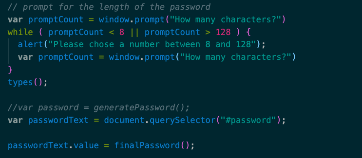

This app takes given variables and places them into a default password structure "option".  Then the variables are ran through a randomizer and a character count slicer based on user input.  

After that the application runs through a series of confirm options to select which portions of the default code to block out of the final resulting password string.  

Here is the link to the deployed page:

[Password Generator Landing Page](https://itorres60.github.io/Password-generator/ "Password Generator")

